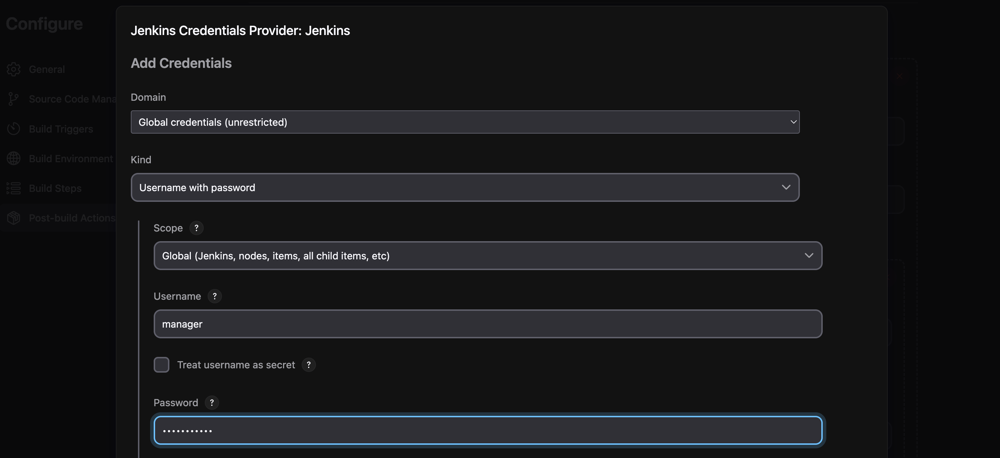
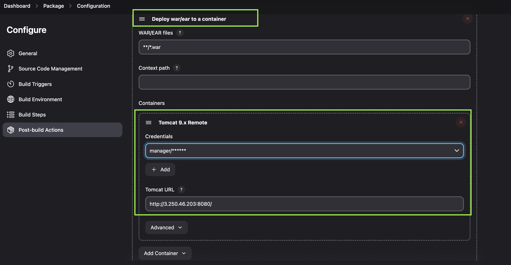
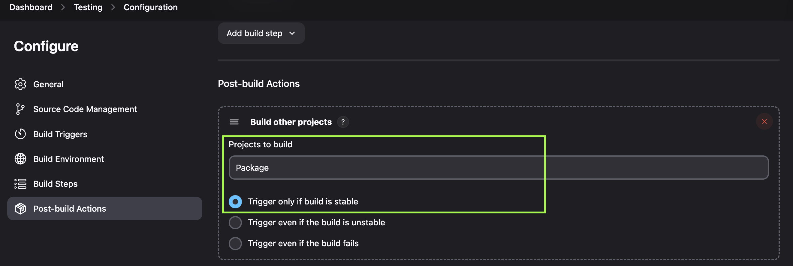
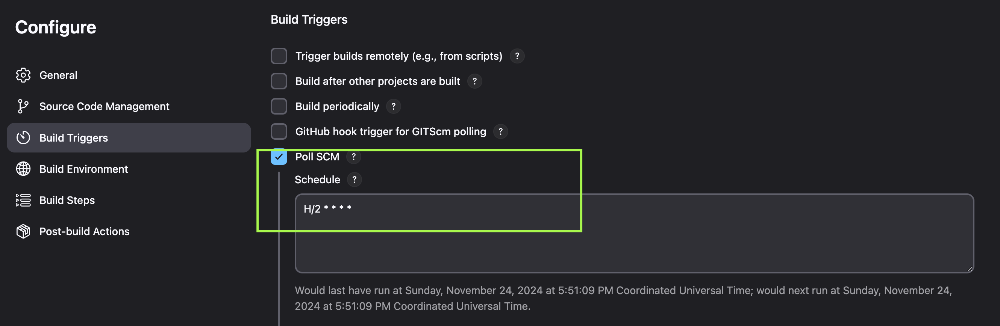

# Industry Grade Project for Post Graduate Certification Program in DevOps
Purpose: Industry Grade Project for Post Graduate Certification Program in DevOps. 
Project Title: Building a CI/CD Pipeline for a Retail Company. 
Tools Used: Github, Jenkins, Ansible, Docker, Kubernetes, Grafana. 
Project Documentation: README file and Google Docs.

# Project Scope: Building a CI/CD Pipeline for a Retail Company

## Problem Statements/Tasks:
We need to develop a CI/CD pipeline to automate the software development, testing, packaging, and deployment, reducing the time to market the app and ensuring good quality service is experienced by end users. In this project, we need to—
push the code to our GitHub repository.
Create a continuous integration pipeline using Jenkins to compile, test, and package the code present in GitHub.
Write a Dockerfile to push the war file to the Tomcat server.
Integrate Docker with Ansible and write the playbook.
Deploy artifacts to the Kubernetes cluster.
Monitor resources using Grafana.

## Approach to Solve:
Task 1: Clone the project from the GitHub link shared in resources to your local machine. Build the code using Maven commands.

Task 2: Set up the Git repository and push the source code. Then, log in to Jenkins.
1. Create a build pipeline containing a job for each
First, for compiling source code.
Second, for testing source code.
Third, packing the code.
2. Execute the CI/CD pipeline to execute the jobs created in step 1
3. Set up a master-slave node to distribute the tasks in the pipeline

Task 3: Write a Docker file. Create an Image and container on the Docker host. Integrate docker host with Jenkins. Create CI/CD job on Jenkins to build and deploy on a container.
1. Enhance the package job created in step 1 of task 2 to create a docker image.
2. In the Docker image, add code to move the war file to the Tomcat server and build the image.

Task 4: Integrate the Docker host with Ansible. Write an Ansible playbook to create an image and create a continuer. Integrate Ansible with Jenkins. Deploy Ansible-playbook. CI/CD job to build code on ansible and deploy it on docker container
1. Deploy Artifacts on Kubernetes
2. Write pod, service, and deployment manifest file
3. Integrate Kubernetes with Ansible
4. Ansible playbook to create deployment and service

Task 5: Using Prometheus, monitor the resources like CPU utilization: Total Usage, Usage per core, usage breakdown, memory, and network on the instance by providing the endpoints on the local host. Install the node exporter and add the URL to the target in Prometheus. Using this data, log in to Grafana and create a dashboard to show the metrics.

# Task 1: Clone the project from the GitHub link shared in resources to your local machine. Build the code using Maven commands.

Original Github Project URL: https://github.com/salwad-basha-shaik/final-devops-project
Maven Executable Path on Local: /Users/dipolimene/Downloads/apache-maven-3.9.9/bin

Clone to Local

Maven Compile

Maven Test

Maven Package

# Task 2: Set up the Git repository and push the source code. Then, log in to Jenkins to create a CICD pipeline.

Github Project URL: https://github.com/Emtwenty-Co/pgdproject_dipolimene.git

Setup Jenkins - Installation guide documented here [Quick Installation of Jenkins on Ubuntu 22.04](https://dipolimene.medium.com/quick-installation-of-jenkins-on-ubuntu-22-04-linux-distribution-9f0a48412525)

